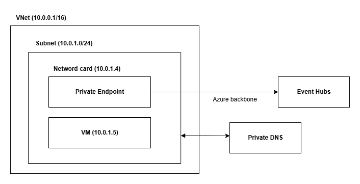
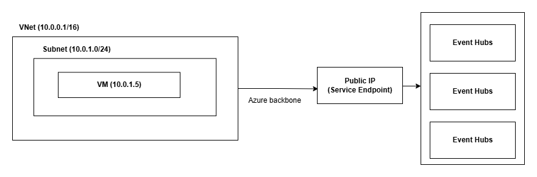
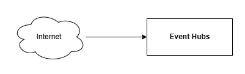

# terraform-azurerm-eventhub
 
This Terraform module provisions an **Azure Event Hub** namespace and its associated resources with support for **private**, **service**, and **public** network modes.
 
## 1. Features
- Support for **private**, **service**, and **public** access modes.
- Automatic provisioning of **private DNS zones** and **virtual network links** if not provided.
- Configurable **IP rules** and **VNet rules** for service endpoint mode.
- Supports tagging, resource grouping, and subnet customization.
## 2. Module Usage
### 2.1. Prerequisites
Ensure that you have the following:
- Terraform `>= 1.3`
- AzureRM Provider `~> 4.25.0`
- Proper permissions in your Azure subscription to create Event Hub, DNS zones, VNets, and Private Endpoints.
### 2.2. `network_mode`
Specify how the Event Hub should be exposed:
- `private`: Uses Private Endpoint and Private DNS Zones (no public access).

  
- `service`: Uses Service Endpoints and IP/VNet rules.

	
- `public`: Open to public internet access 

	
### 2.3. Input Variables

| Name                   | Type           | Required | Default                | Description                                                                 |
| ---------------------- | -------------- | -------- | ---------------------- | --------------------------------------------------------------------------- |
| `namespace`            | `string`       | ✅        | —                      | The name of the Event Hub.                                                  |
| `topics`               | `list(string)` | ❌        | `[]`                   | The list of topics in the Event Hub Namespace.                              |
| `capacity`             | `number`       | ❌        | `1`                    | Number of PUs for the Event Hub Namespace.                                  |
| `partition_count`      | `number`       | ❌        | `1`                    | The number of partitions for each Event Hub (topic).                        |
| `network_mode`         | `string`       | ✅        | —                      | Network mode for Event Hub: `private`, `service`, `public`.                 |
| `private_dns_zone_ids` | `list(string)` | ❌        | `[]`                   | The resource ID of the private DNS zone for Event Hub.                      |
| `subnet_ids`           | `list(string)` | ❌        | `[]`                   | The resource ID of the subnet.                     |
| `ip_rules`             | `list(string)` | ❌        | `[]`                   | CIDR blocks to allow access (only for service endpoints).                   |
| `vnet_ids`             | `list(string)` | ❌        | `[]`                   | VNet IDs used for linking to Private DNS Zone (only for private endpoints). |
| `resource_group_name`  | `string`       | ❌        | `"terraform-eventhub"` | The name of the resource group where the resources will be created.         |
| `location`             | `string`       | ✅        | —                      | The Azure location where the resources will be created.                     |
| `tags`                 | `map(string)`  | ❌        | `{}`                   | Tags to assign to the resources.                                            |

### 2.4 Example
### Variable require by `network mode`
 
| `network_mode`       | `private_dns_zone_ids` | `subnet_ids` | `vnet_ids` | `ip_rules` |
| -------------------- | ---------------------- | ------------ | ---------- | ---------- |
| **Private Endpoint** | 🟦                     | ✅ (At least 1)          | ✅         | ❌         |
| **Service Endpoint** | ❌                     | ✅           | ❌         | 🟦         |
| **Public Endpoint**  | ❌                     | ❌           | ❌         | ❌         |

##### Notes:
- ✅ = **Required** 
- ❌ = **Not required**
- 🟦 = **Optional**

#### main.tf 
Network mode - Private
- When use private mode, variable `subnet_ids` is where the ip of private endpoint will be created. So you just need at least one subnet id, all the subnets in the vnet will be conect to event hub.
```hcl
module "eventhub" {
  source  = "azure-terraform-module/event-hubs-kafka/azure"
  version = "0.0.3"

  # Required variables
  namespace         = "my-eventhub-private-mode" # Must be unique name
  resource_group_name   = "my-rg"
  location              = "eastus"
  network_mode = "private"
 
  subnet_ids = [
	"/subscriptions/xxx/resourceGroups/my-rg/providers/Microsoft.Network/virtualNetworks/my-vnet/subnets/subnet1"
  ]
 
  vnet_ids = [
	"/subscriptions/xxx/resourceGroups/my rg/providers/Microsoft.Network/virtualNetworks/my-vnet"
  ]

  # Optional variables
  private_dns_zone_ids = [
    "/subscriptions/xxx/resourceGroups/my-rg/providers/Microsoft.Network/privateDnsZones/my-private-dns-zone"
  ]
 
  tags = {
    environment = "dev"
    project     = "eventhub-provisioning"
  }
 
  topics = [
    "topic1",
    "topic2"
  ]
}
```

Network mode - Service
- When use service mode, subnet_ids is what subnet can access the event hub. So you need to add the subnet id that you want to access the event hub.
```hcl
module "eventhub" {
  source  = "github.com/<your-org>/terraform-azurerm-eventhub"
  # Required variables
  namespace         = "my-eventhub-service-mode" 
  resource_group_name   = "my-rg"
  location              = "eastus"
  network_mode = "service"
 
  subnet_ids = [
    "/subscriptions/xxx/resourceGroups/my-rg/providers/Microsoft.Network/virtualNetworks/my-vnet/subnets/subnet1"
  ]
 
  # Optional variables
  ip_rules = [
    "203.0.113.10"
  ]
 
  tags = {
    environment = "dev"
    project     = "eventhub-provisioning"
  }
 
  topics = [
    "topic1",
    "topic2"
  ]
}
```

Network mode - Public
```hcl
module "eventhub" {
  source  = "github.com/<your-org>/terraform-azurerm-eventhub"
  # Required variables
  namespace         = "my-eventhub-public-mode"
  resource_group_name   = "my-rg"
  location              = "eastus"
  network_mode = "public"
 
  tags = {
    environment = "dev"
    project     = "eventhub-provisioning"
  }
 
  topics = [
    "topic1",
    "topic2"
  ]
}
```

#### provider.tf 
```hcl
terraform {
  required_version = ">= 1.9, < 2.0"
  required_providers {
    azurerm = {
      source  = "hashicorp/azurerm"
      version = "4.25.0"
    }
  }
  backend "azurerm" {
    resource_group_name  = "<your-resource-group-name>"
    storage_account_name = "<your-storage-account-name>"
    container_name       = "<your-container-name>"
    key                  = "<your-key>"
    subscription_id = "<your-subscription-id>"
    }
}

provider "azurerm" {
  features {
  }
  subscription_id = "<your-subscription-id>"
}
```

#### outputs.tf
```hcl
output "namespace" {
  description = "The name of the Event Hub Namespace"
  value       = module.eventhub.namespace
}

output "namespace_id" {
  description = "The ID of the Event Hub Namespace"
  value       = module.eventhub.namespace_id
}  

output "topics" {
  description = "List of Event Hub topics from the module"
  value       = module.eventhub.topics
}

output "hostname" {
  description = "The hostname of the Event Hub Namespace"
  value       = module.eventhub.hostname
}
```
